# 🔄 Business Flow Documentation
## Sinar Harapan Frontdesk & Property Management System (PMS)

---

## Dokumen Kontrol

| Item | Detail |
|---|---|
| Versi | 1.0 — Baseline |
| Tujuan | Menjelaskan alur proses bisnis end-to-end, termasuk jalur normal (happy path) dan jalur gagal (edge case), sebagai rujukan QA, developer, dan AI agent saat implementasi |
| Terkait | `prd.md`, `arsitektur.md`, `backend.md`, `endpoint.md` |
| Aktor | Resepsionis, Manajer, Tamu (pasif — tidak punya akun), Sistem (cron/scheduler), Layanan Pihak Ketiga (Google Vision, WA Gateway) |

---

## 1. Ringkasan Aktor & Tanggung Jawab

| Aktor | Peran dalam Alur |
|---|---|
| **Resepsionis** | Menjalankan seluruh transaksi front-desk: check-in, check-out, resend WA, tandai kamar bersih |
| **Manajer** | Mengatur inventaris kamar, memantau dashboard, mengunduh laporan, meninjau audit log |
| **Tamu** | Objek data (dokumen identitas KTP/Paspor/SIM, WA), tidak punya akses sistem, menerima notifikasi WA pasif |
| **Sistem (Cron Scheduler)** | Berjalan otomatis tiap 10 menit, memicu pengingat check-out |
| **Google Cloud Vision** | Layanan eksternal — OCR ekstraksi data dari dokumen identitas (KTP, Paspor via MRZ, SIM) |
| **WhatsApp Gateway (Fonnte/Wablas)** | Layanan eksternal — pengiriman & callback status pesan |

---

## 2. Alur Utama 1 — Check-in Tamu Walk-in

### 2.1 Diagram Alur

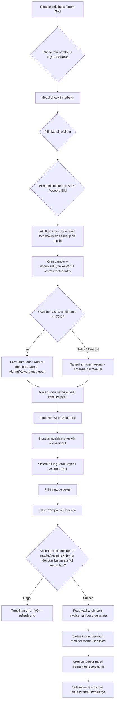

### 2.2 Detail Langkah

| # | Aktor | Aksi | Sistem |
|---|---|---|---|
| 1 | Resepsionis | Membuka layar Room Grid | `GET /rooms/status` dipanggil setiap 15 detik (polling) |
| 2 | Resepsionis | Klik kartu kamar Hijau | Modal check-in terbuka, `roomId` diteruskan |
| 3 | Resepsionis | Pilih kanal "Walk-in" | Field `reddoorzBookingCode` disembunyikan/dikosongkan |
| 3b | Resepsionis | Pilih jenis dokumen identitas (KTP/Paspor/SIM) | Menentukan parser OCR yang dipakai backend |
| 4 | Resepsionis | Foto/upload dokumen identitas | `POST /ocr/extract-identity` (multipart + `documentType`), timeout 3 detik |
| 5 | Sistem | OCR memproses gambar sesuai jenis dokumen | Jika confidence < 70% → `perluVerifikasiManual: true`, badge peringatan ditampilkan |
| 6 | Resepsionis | Cek & koreksi data | Field tetap dapat diedit manual meski dari OCR |
| 7 | Resepsionis | Isi No. WA & durasi menginap | Validasi format WA (`+62`/`08...`) di client & server |
| 8 | Resepsionis | Pilih metode bayar & tekan Simpan | `POST /reservations` dengan payload lengkap |
| 9 | Sistem | Transaksi database (lihat `backend.md` §8.2) | Row lock kamar, cek duplikasi nomor identitas (idType+idNumber), generate invoice, update status kamar |
| 10 | Sistem | Aktifkan pemantauan cron | Reservasi otomatis masuk kandidat pengingat WA saat mendekati waktu checkout |

### 2.3 Precondition & Postcondition

- **Precondition:** Resepsionis sudah login (JWT valid), kamar berstatus `AVAILABLE`.
- **Postcondition sukses:** `reservations` baru tercatat, `rooms.status = OCCUPIED`, `activity_logs` mencatat `CHECK_IN`.
- **Postcondition gagal:** Tidak ada perubahan data (transaksi di-rollback), pesan error ditampilkan ke resepsionis.

---

## 3. Alur Utama 2 — Check-in Tamu RedDoorz

Alur identik dengan §2, dengan perbedaan pada langkah kanal pemesanan:

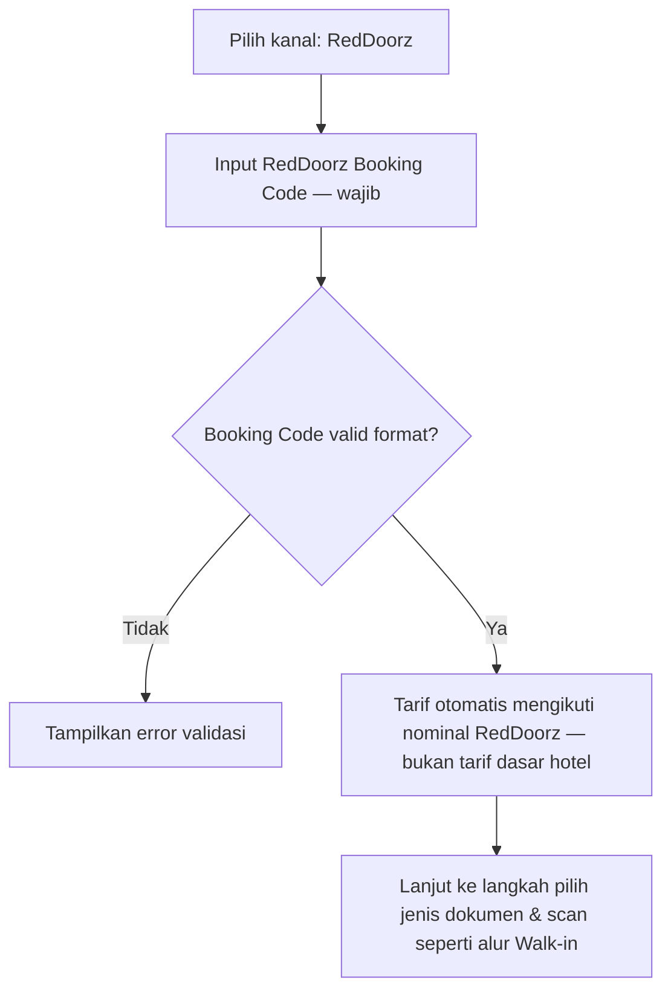

**Catatan penting:** Sistem **tidak memverifikasi** Booking Code ke API RedDoorz secara real-time pada MVP (di luar scope — RedDoorz bukan penyedia API terbuka untuk mitra kecil). Validasi hanya di level format & kewajiban field. Resepsionis bertanggung jawab memverifikasi kecocokan booking secara manual dengan aplikasi RedDoorz mereka.

**Metode pembayaran untuk RedDoorz:** biasanya `REDDOORZ_PREPAID` (sudah dibayar di aplikasi), namun field tetap fleksibel jika ada pembayaran tambahan di lokasi (mis. deposit).

**Catatan tamu WNA via RedDoorz:** tamu mancanegara yang memesan lewat RedDoorz tetap memilih jenis dokumen "Paspor" di langkah scan — alur dan validasi sama persis, hanya kanal pemesanannya berbeda.

---

## 4. Alur Cabang — Kegagalan OCR

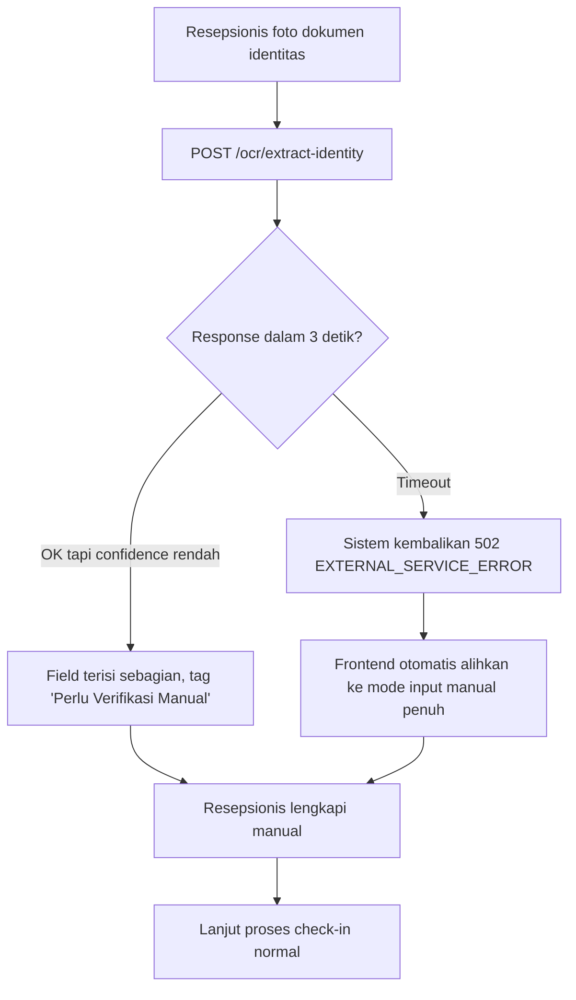

**Business rule:** kegagalan OCR **TIDAK PERNAH** memblokir proses check-in — berlaku sama untuk KTP, Paspor, maupun SIM. Ini adalah keputusan desain eksplisit — OCR adalah alat bantu kecepatan, bukan gerbang wajib (sesuai NFR "check-in < 2 menit" harus tetap tercapai walau OCR down).

**Catatan khusus Paspor:** kegagalan parsing MRZ (mis. foto miring, MRZ tertutup jari) punya kemungkinan lebih tinggi dibanding KTP/SIM karena posisi karakter MRZ sangat presisi — pastikan UI kamera menampilkan panduan bingkai khusus area MRZ (baris bawah halaman biodata paspor) saat `documentType = PASSPORT` dipilih.

---

## 5. Alur Utama 3 — Pengingat Check-out Otomatis (WhatsApp)

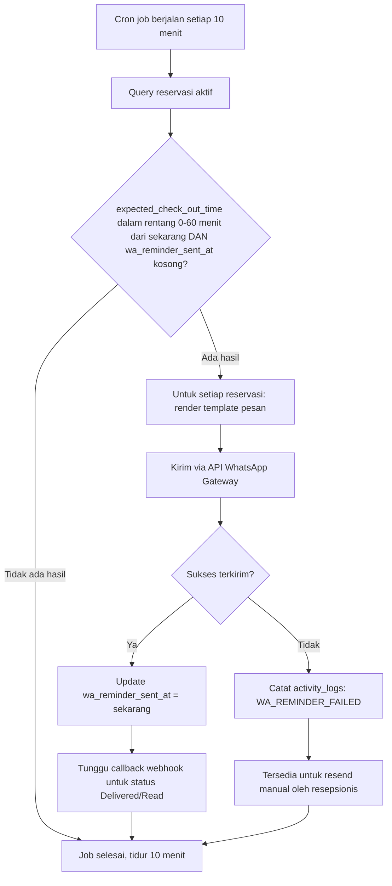

### 5.1 Alur Resend Manual (Fallback)

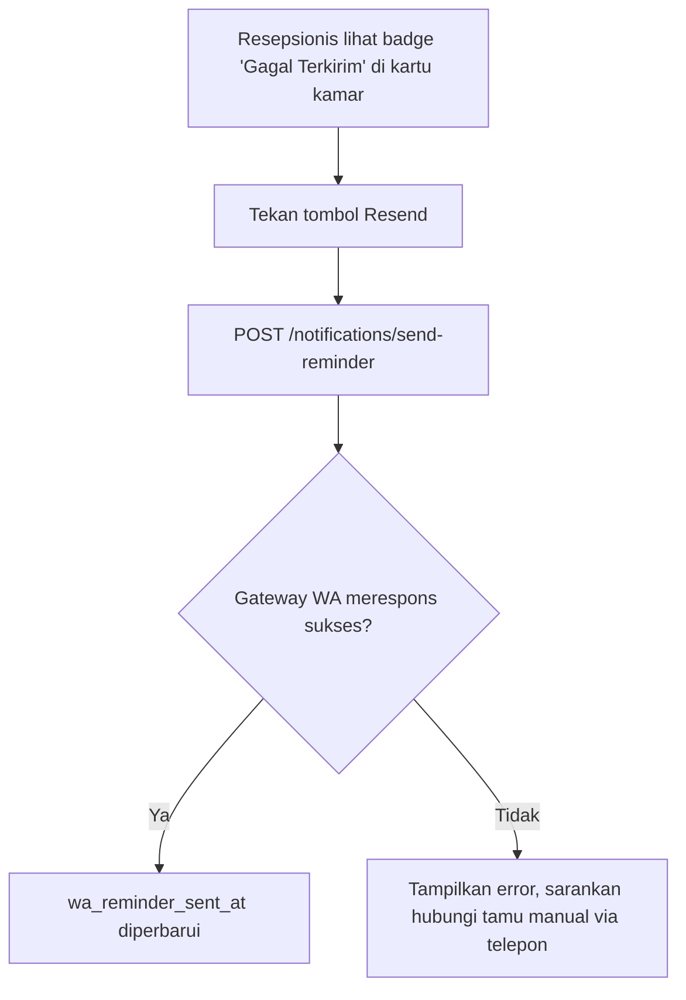

---

## 6. Alur Utama 4 — Check-out & Invoice

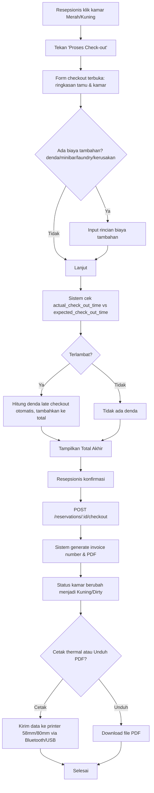

### 6.1 Alur Lanjutan — Pembersihan Kamar

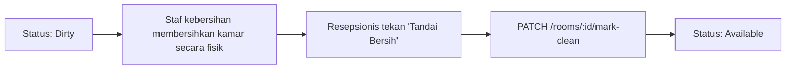

> **Catatan:** proses pembersihan fisik terjadi di luar sistem (tidak ada modul housekeeping di MVP — lihat `prd.md` §1.3 Ruang Lingkup). Sistem hanya mencatat transisi status yang dipicu manual oleh resepsionis.

---

## 7. State Diagram — Siklus Hidup Status Kamar

```mermaid
stateDiagram-v2
    [*] --> AVAILABLE: Kamar baru ditambahkan Manajer
    AVAILABLE --> OCCUPIED: Check-in berhasil
    OCCUPIED --> DIRTY: Check-out selesai
    DIRTY --> AVAILABLE: Resepsionis tandai bersih
    AVAILABLE --> MAINTENANCE: Manajer set maintenance
    MAINTENANCE --> AVAILABLE: Manajer set kembali available
    OCCUPIED --> MAINTENANCE: DITOLAK — tidak boleh ada reservasi aktif
    DIRTY --> MAINTENANCE: DITOLAK — tidak boleh ada reservasi aktif (actual_check_out_time harus terisi dulu, tapi masih perlu clean-up state; kebijakan: hanya AVAILABLE yang bisa ke MAINTENANCE)
```

**Aturan transisi yang ditegakkan backend** (lihat `backend.md` §8.2):
- `OCCUPIED → MAINTENANCE` **DITOLAK** — kamar dengan tamu aktif tidak boleh dinonaktifkan.
- Kamar hanya bisa dihapus (`DELETE`) jika tidak pernah punya reservasi aktif yang belum checkout.

---

## 8. Alur Utama 5 — Manajemen Kamar oleh Manajer (CRUD)

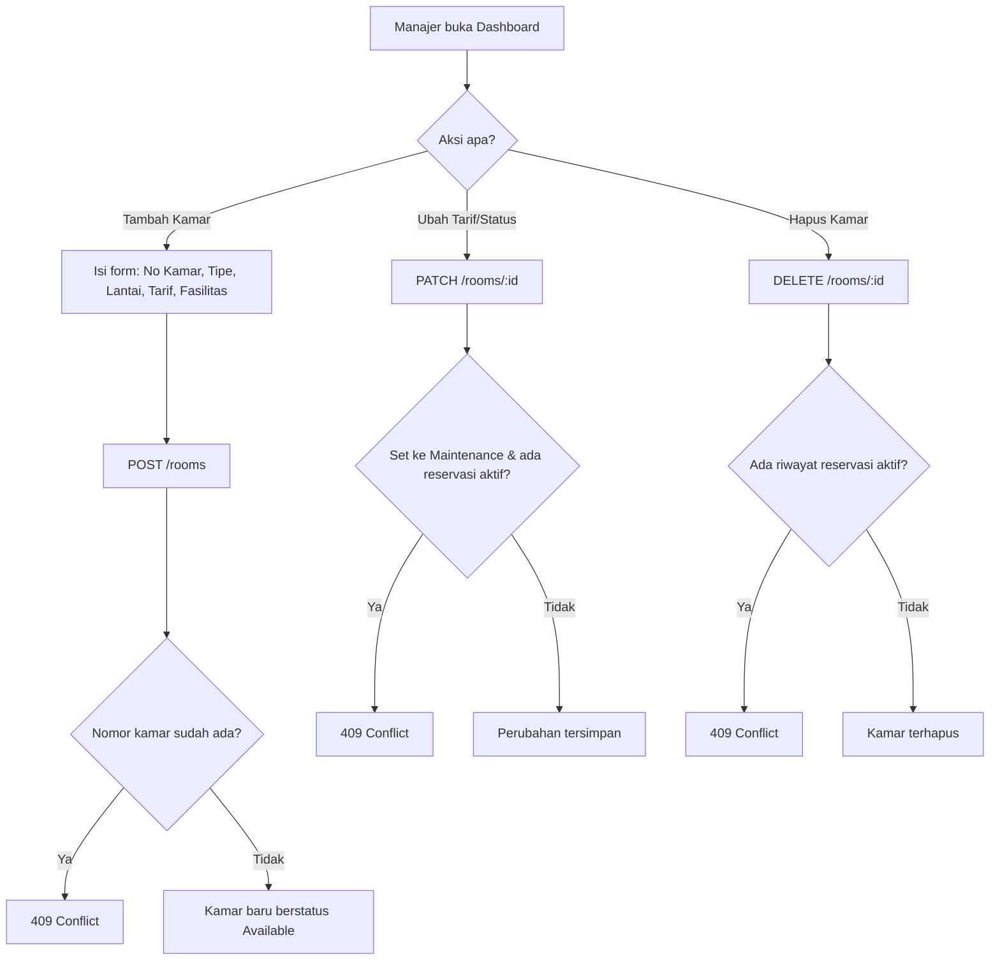

---

## 9. Alur Utama 6 — Pelaporan & Ekspor Manajer

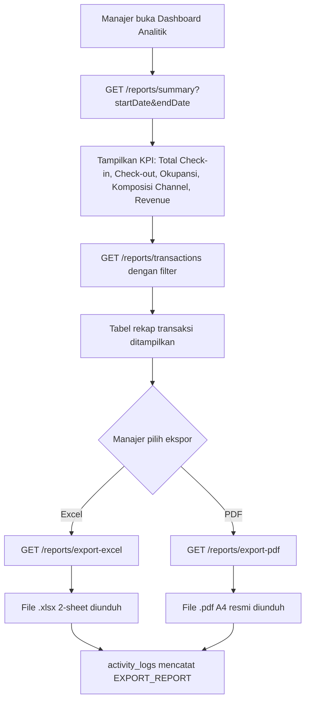

---

## 10. Alur Login & Sesi

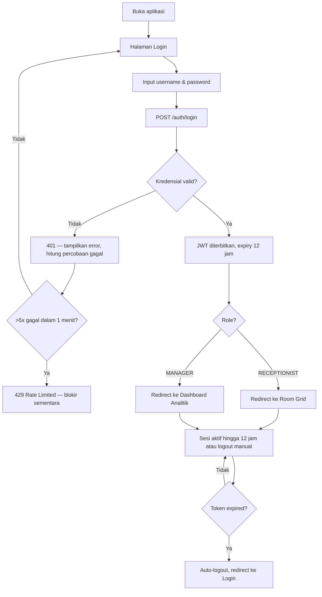

---

## 11. Alur Edge Case Kritis (Wajib Ditangani)

### 11.1 Race Condition — Dua Resepsionis Check-in Kamar Sama

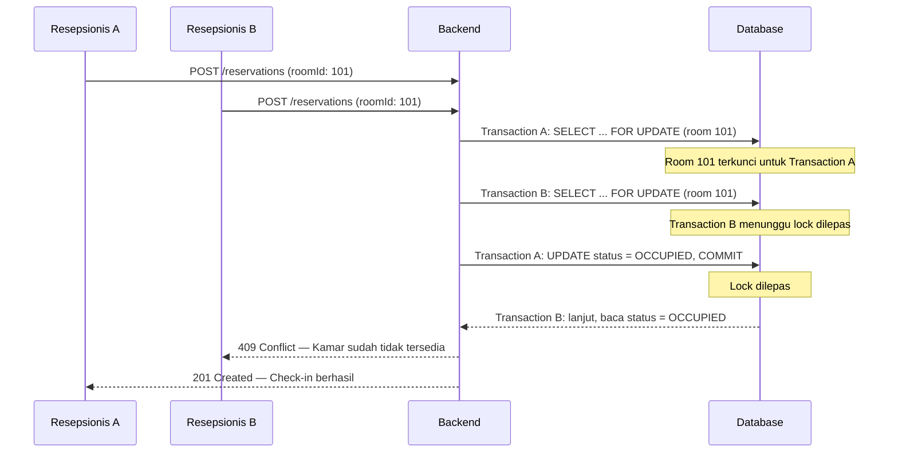

### 11.2 Layanan WhatsApp Gateway Down Total

```
Kondisi: Fonnte/Wablas API tidak merespons untuk seluruh reservasi yang jatuh tempo.
Dampak: wa_reminder_sent_at tetap NULL, activity_logs mencatat WA_REMINDER_FAILED berulang.
Mitigasi operasional: Resepsionis tetap dapat memantau waktu checkout secara visual
  dari badge Kuning (H-1 jam) di Room Grid meski notifikasi WA gagal — sistem TIDAK
  bergantung 100% pada WA sebagai satu-satunya sinyal.
Mitigasi teknis: Alert otomatis ke tim dev jika job cron gagal berturut-turut >= 3x
  (lihat arsitektur.md §6.3).
```

### 11.3 Koneksi Internet Resepsionis Terputus Saat Input Form

```
Kondisi: Resepsionis sedang mengisi form check-in, koneksi terputus mendadak.
Perilaku sistem (Flutter):
  1. Data form tersimpan otomatis ke local cache (Hive) setiap perubahan field.
  2. Badge "Belum tersinkron" muncul di form.
  3. Background retry setiap 30 detik.
  4. Setelah koneksi pulih, submit otomatis terjadi TANPA resepsionis mengetik ulang.
  5. Jika ternyata kamar sudah di-check-in resepsionis lain selama offline
     (kasus jarang, hanya jika ada override manual), sistem tetap menampilkan 409
     Conflict dan meminta resepsionis pilih kamar lain.
```

### 11.4 Nomor Identitas Sama Dipakai untuk Check-in di Kamar Berbeda

```
Kondisi: Tamu A sudah check-in di kamar 101 (mis. pakai KTP), nomor identitas yang sama
  (kombinasi idType+idNumber) dicoba di-check-in lagi ke kamar 205
  (baik oleh resepsionis sama atau shift berbeda).
Perilaku sistem: 409 Conflict — "Nomor KTP ini sedang aktif check-in di kamar lain."
  (pesan menyesuaikan idType: KTP/Paspor/SIM)
Catatan: NIK yang sama tapi didaftarkan sebagai Paspor di kamar lain TIDAK dianggap
  duplikat oleh sistem (idType berbeda = identitas berbeda secara data) — kasus ini
  sangat jarang terjadi dan bukan celah keamanan praktis, hanya konsekuensi desain
  dari mendukung banyak jenis dokumen sekaligus.
Kasus valid yang perlu penanganan manual: rombongan keluarga dengan KTP kepala
  keluarga dipakai untuk banyak kamar — di luar validasi otomatis sistem,
  memerlukan kebijakan hotel (mis. input nomor identitas anggota keluarga lain atau
  catatan manual di kolom alamat/nama).
```

---

## 12. Ringkasan Tanggung Jawab per Layar (Swimlane Summary)

| Layar | Aktor Utama | Endpoint Terlibat | Trigger Otomatis |
|---|---|---|---|
| Login | Resepsionis, Manajer | `POST /auth/login` | Rate limiter setelah 5x gagal |
| Room Grid | Resepsionis | `GET /rooms/status` (polling 15 detik) | — |
| Modal Check-in | Resepsionis | `POST /ocr/extract-identity`, `POST /reservations` | — |
| Check-out & Invoice | Resepsionis | `POST /reservations/:id/checkout` | Kalkulasi denda otomatis |
| Dashboard Manajer | Manajer | `GET /reports/summary`, `GET /reports/transactions` | — |
| Ekspor Laporan | Manajer | `GET /reports/export-excel`, `GET /reports/export-pdf` | — |
| (Latar belakang) | Sistem | — | Cron job tiap 10 menit → `whatsapp.service` |
| (Latar belakang) | WA Gateway | `POST /notifications/webhook` | Callback status pengiriman |
