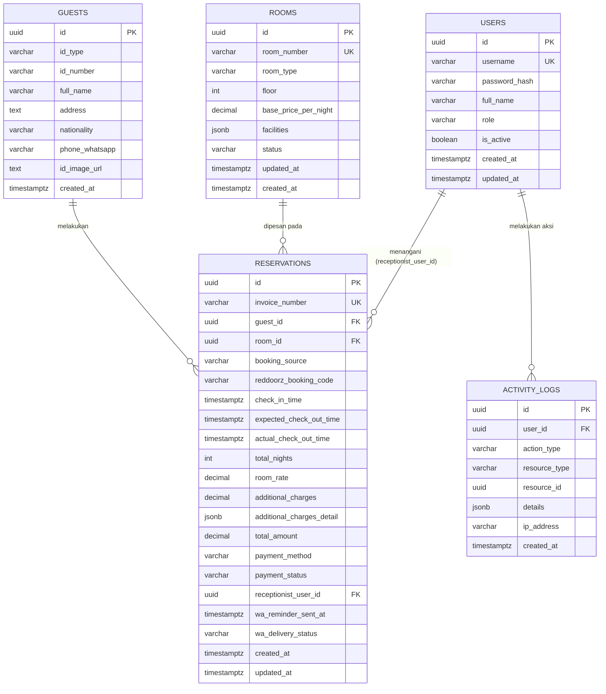

# 🗄️ Database Documentation
## Sinar Harapan Frontdesk & Property Management System (PMS)

---

## Dokumen Kontrol

| Item | Detail |
|---|---|
| Versi | 1.0 — Baseline |
| Engine | PostgreSQL 15+ (Supabase Managed) |
| ORM | Prisma 5.x |
| Region | Singapore (latensi rendah ke Indonesia) |
| Terkait | `arsitektur.md`, `backend.md`, `security.md` |

---

## 1. Entity Relationship Diagram



---

## 2. Deskripsi Tabel Lengkap

### 2.1 `users` — Akun Staf

| Kolom | Tipe | Constraint | Keterangan |
|---|---|---|---|
| `id` | UUID | PK, default `gen_random_uuid()` | — |
| `username` | VARCHAR(50) | UNIQUE, NOT NULL | Login identifier |
| `password_hash` | VARCHAR(255) | NOT NULL | bcrypt hash, cost 10 — TIDAK PERNAH di-select ke response API |
| `full_name` | VARCHAR(100) | NOT NULL | Ditampilkan di UI & invoice |
| `role` | VARCHAR(20) | CHECK IN (`RECEPTIONIST`, `MANAGER`) | Menentukan RBAC |
| `is_active` | BOOLEAN | DEFAULT TRUE | Nonaktifkan staf tanpa hapus riwayat (soft-disable) |
| `created_at` / `updated_at` | TIMESTAMPTZ | DEFAULT `NOW()` | — |

**Index:** `idx_users_username` (untuk lookup login cepat).

### 2.2 `rooms` — Master Inventaris Kamar

| Kolom | Tipe | Constraint | Keterangan |
|---|---|---|---|
| `id` | UUID | PK | — |
| `room_number` | VARCHAR(10) | UNIQUE, NOT NULL | Nomor fisik kamar |
| `room_type` | VARCHAR(50) | NOT NULL | Standard/Superior/Deluxe/Family |
| `floor` | INTEGER | NOT NULL | — |
| `base_price_per_night` | DECIMAL(12,2) | NOT NULL | Tarif dasar (dipakai untuk Walk-in) |
| `facilities` | JSONB | DEFAULT `[]` | Array string, mis. `["AC","TV"]` |
| `status` | VARCHAR(20) | CHECK IN (`AVAILABLE`,`OCCUPIED`,`DIRTY`,`MAINTENANCE`) | Lihat state diagram di `business-flow.md` §7 |
| `updated_at` / `created_at` | TIMESTAMPTZ | — | `updated_at` berubah setiap transisi status |

**Index:** `idx_rooms_status` (untuk query grid cepat per status), `idx_rooms_type_floor` (untuk filter FR-ROOM-03).

**Kenapa `facilities` JSONB, bukan tabel terpisah:** daftar fasilitas bersifat sederhana (array string pendek), tidak butuh query relasional kompleks (mis. "cari semua kamar dengan fasilitas AC" bukan kebutuhan MVP) — JSONB menghindari over-engineering skema untuk kasus penggunaan yang belum terbukti dibutuhkan.

### 2.3 `guests` — Data Induk Tamu

> **Perubahan v1.1:** tabel ini digeneralisasi untuk mendukung banyak jenis dokumen identitas
> (KTP, Paspor, SIM, dan dokumen lain), bukan hanya NIK KTP. Ini mengganti kolom `nik` menjadi
> pasangan `id_type` + `id_number`, karena format nomor identitas berbeda-beda per jenis dokumen
> (NIK KTP selalu 16 digit angka, nomor paspor Indonesia format 1 huruf + 7 digit, SIM punya
> pola tersendiri, dan paspor asing bervariasi menurut negara penerbit).

| Kolom | Tipe | Constraint | Keterangan |
|---|---|---|---|
| `id` | UUID | PK | — |
| `id_type` | VARCHAR(20) | CHECK IN (`KTP`,`PASSPORT`,`SIM`,`OTHER`), NOT NULL | Jenis dokumen identitas yang dipakai saat check-in |
| `id_number` | VARCHAR(30) | NOT NULL | Nomor identitas sesuai jenis dokumen — format divalidasi per `id_type` di application layer (lihat `backend.md` §8.1), BUKAN dengan `CHECK` SQL tunggal karena polanya berbeda per jenis |
| `full_name` | VARCHAR(150) | NOT NULL | — |
| `address` | TEXT | NULLABLE | Dari OCR atau input manual — sering kosong untuk paspor (paspor umumnya tidak mencantumkan alamat lengkap) |
| `nationality` | VARCHAR(50) | NULLABLE | Terutama relevan untuk tamu dengan Paspor (WNA) — diekstrak dari MRZ paspor, lihat `backend.md` §8.3 |
| `phone_whatsapp` | VARCHAR(20) | NOT NULL | Wajib — dipakai untuk notifikasi |
| `id_image_url` | TEXT | NULLABLE | Path ke Supabase Storage/VPS storage, BUKAN signed URL final (signed URL digenerate on-demand, lihat `security.md` §6.2). Nama kolom digeneralisasi dari `ktp_image_url` |
| `created_at` | TIMESTAMPTZ | — | — |

**Constraint gabungan:** `UNIQUE (id_type, id_number)` — bukan `UNIQUE` pada `id_number` saja, karena nomor identitas dari jenis dokumen berbeda secara teori bisa punya format string yang sama (walau sangat jarang), dan secara semantik keduanya adalah entitas berbeda.

**Index:** `idx_guests_id_number` pada kombinasi `(id_type, id_number)` (untuk cek duplikasi aktif, lihat `backend.md` §8.5), `idx_guests_phone`.

**Catatan desain:** satu `Guest` (by kombinasi `id_type` + `id_number`) bisa punya banyak `Reservation` sepanjang waktu (tamu yang menginap berulang) — data tamu tidak diduplikasi tiap check-in, cukup di-`upsert` berdasarkan `(id_type, id_number)` (lihat `backend.md` §8.2).

### 2.4 `reservations` — Transaksi Inti

| Kolom | Tipe | Constraint | Keterangan |
|---|---|---|---|
| `id` | UUID | PK | — |
| `invoice_number` | VARCHAR(50) | UNIQUE, NOT NULL | Format `INV/SH/YYYYMMDD/XXXX`, lihat `backend.md` §8.4 |
| `guest_id` | UUID | FK → `guests.id`, `ON DELETE RESTRICT` | Tidak boleh hapus guest yang masih punya reservasi |
| `room_id` | UUID | FK → `rooms.id`, `ON DELETE RESTRICT` | Sejalan dengan aturan hapus kamar di `backend.md` §8.2 |
| `booking_source` | VARCHAR(20) | CHECK IN (`REDDOORZ`,`WALK_IN`) | — |
| `reddoorz_booking_code` | VARCHAR(50) | NULLABLE | Wajib diisi (divalidasi di app-layer) jika `booking_source = REDDOORZ` |
| `check_in_time` | TIMESTAMPTZ | NOT NULL | — |
| `expected_check_out_time` | TIMESTAMPTZ | NOT NULL | Target dasar untuk kalkulasi pengingat WA & denda |
| `actual_check_out_time` | TIMESTAMPTZ | NULLABLE | NULL = reservasi masih aktif (kamar Occupied/Dirty) |
| `total_nights` | INTEGER | NOT NULL | — |
| `room_rate` | DECIMAL(12,2) | NOT NULL | Snapshot tarif SAAT check-in (bukan referensi live ke `rooms.base_price_per_night` — penting agar histori invoice tidak berubah jika tarif kamar diedit manajer di kemudian hari) |
| `additional_charges` | DECIMAL(12,2) | DEFAULT 0 | Total biaya tambahan + denda late checkout |
| `additional_charges_detail` | JSONB | DEFAULT `[]` | Rincian per item: `[{label, amount}]` |
| `total_amount` | DECIMAL(12,2) | NOT NULL | `room_rate × total_nights + additional_charges` |
| `payment_method` | VARCHAR(30) | NOT NULL | CASH/QRIS/TRANSFER/REDDOORZ_PREPAID |
| `payment_status` | VARCHAR(20) | CHECK IN (`PAID`,`PENDING`,`CANCELLED`), DEFAULT `PAID` | — |
| `receptionist_user_id` | UUID | FK → `users.id`, NULLABLE | Nullable agar histori tidak hilang jika akun staf dihapus (idealnya staf hanya di-nonaktifkan, bukan dihapus — lihat `is_active`) |
| `wa_reminder_sent_at` | TIMESTAMPTZ | NULLABLE | NULL = belum dikirim, dipakai query cron |
| `wa_delivery_status` | VARCHAR(20) | NULLABLE | SENT/DELIVERED/READ/FAILED dari webhook callback |
| `created_at` / `updated_at` | TIMESTAMPTZ | — | — |

**Index:**
- `idx_reservations_room` — lookup reservasi per kamar
- `idx_reservations_guest` — lookup histori per tamu
- `idx_reservations_checkin` — filter laporan by tanggal check-in
- `idx_reservations_expected_checkout` (**partial index**, `WHERE actual_check_out_time IS NULL`) — dioptimalkan khusus untuk query cron job setiap 10 menit yang HANYA menyisir reservasi aktif, bukan seluruh histori
- `idx_reservations_invoice` — lookup cepat by nomor invoice (cetak ulang struk)

**Kenapa `room_rate` disimpan sebagai snapshot:** ini keputusan desain kritis — jika manajer mengubah `base_price_per_night` kamar 101 dari Rp250.000 menjadi Rp300.000 di bulan depan, invoice reservasi BULAN INI tidak boleh ikut berubah retroaktif. Snapshot memastikan integritas historis laporan keuangan.

### 2.5 `activity_logs` — Audit Trail

| Kolom | Tipe | Constraint | Keterangan |
|---|---|---|---|
| `id` | UUID | PK | — |
| `user_id` | UUID | FK → `users.id`, NULLABLE | Nullable untuk log sistem otomatis (mis. cron job gagal) tanpa aktor manusia |
| `action_type` | VARCHAR(50) | NOT NULL | Lihat daftar lengkap di `backend.md` §8.8 |
| `resource_type` | VARCHAR(50) | NULLABLE | `reservation`, `room`, `report`, dst. |
| `resource_id` | UUID | NULLABLE | Referensi ke record terkait (bukan foreign key formal — resource bisa dari tabel berbeda-beda) |
| `details` | JSONB | NULLABLE | Konteks tambahan (lihat aturan isi di `security.md` §7.2) |
| `ip_address` | VARCHAR(45) | NULLABLE | Mendukung IPv6 (45 karakter) |
| `created_at` | TIMESTAMPTZ | — | — |

**Index:** `idx_activity_logs_user`, `idx_activity_logs_action`, `idx_activity_logs_created` (untuk filter rentang tanggal di `GET /audit-logs`).

**Sifat tabel:** append-only — tidak ada `UPDATE`/`DELETE` di level aplikasi (lihat `security.md` §7.3).

---

## 3. DDL Lengkap (Referensi)

```sql
CREATE TABLE users (
    id UUID PRIMARY KEY DEFAULT gen_random_uuid(),
    username VARCHAR(50) UNIQUE NOT NULL,
    password_hash VARCHAR(255) NOT NULL,
    full_name VARCHAR(100) NOT NULL,
    role VARCHAR(20) CHECK (role IN ('RECEPTIONIST', 'MANAGER')) NOT NULL,
    is_active BOOLEAN DEFAULT TRUE,
    created_at TIMESTAMP WITH TIME ZONE DEFAULT NOW(),
    updated_at TIMESTAMP WITH TIME ZONE DEFAULT NOW()
);
CREATE INDEX idx_users_username ON users(username);

CREATE TABLE rooms (
    id UUID PRIMARY KEY DEFAULT gen_random_uuid(),
    room_number VARCHAR(10) UNIQUE NOT NULL,
    room_type VARCHAR(50) NOT NULL,
    floor INTEGER NOT NULL,
    base_price_per_night DECIMAL(12, 2) NOT NULL,
    facilities JSONB DEFAULT '[]',
    status VARCHAR(20) CHECK (status IN ('AVAILABLE', 'OCCUPIED', 'DIRTY', 'MAINTENANCE')) DEFAULT 'AVAILABLE',
    updated_at TIMESTAMP WITH TIME ZONE DEFAULT NOW(),
    created_at TIMESTAMP WITH TIME ZONE DEFAULT NOW()
);
CREATE INDEX idx_rooms_status ON rooms(status);
CREATE INDEX idx_rooms_type_floor ON rooms(room_type, floor);

CREATE TABLE guests (
    id UUID PRIMARY KEY DEFAULT gen_random_uuid(),
    id_type VARCHAR(20) CHECK (id_type IN ('KTP', 'PASSPORT', 'SIM', 'OTHER')) NOT NULL,
    id_number VARCHAR(30) NOT NULL,
    full_name VARCHAR(150) NOT NULL,
    address TEXT,
    nationality VARCHAR(50),
    phone_whatsapp VARCHAR(20) NOT NULL,
    id_image_url TEXT,
    created_at TIMESTAMP WITH TIME ZONE DEFAULT NOW(),
    UNIQUE (id_type, id_number)
);
CREATE INDEX idx_guests_id_number ON guests(id_type, id_number);
CREATE INDEX idx_guests_phone ON guests(phone_whatsapp);

CREATE TABLE reservations (
    id UUID PRIMARY KEY DEFAULT gen_random_uuid(),
    invoice_number VARCHAR(50) UNIQUE NOT NULL,
    guest_id UUID REFERENCES guests(id) ON DELETE RESTRICT,
    room_id UUID REFERENCES rooms(id) ON DELETE RESTRICT,
    booking_source VARCHAR(20) CHECK (booking_source IN ('REDDOORZ', 'WALK_IN')) NOT NULL,
    reddoorz_booking_code VARCHAR(50),
    check_in_time TIMESTAMP WITH TIME ZONE NOT NULL,
    expected_check_out_time TIMESTAMP WITH TIME ZONE NOT NULL,
    actual_check_out_time TIMESTAMP WITH TIME ZONE,
    total_nights INTEGER NOT NULL,
    room_rate DECIMAL(12, 2) NOT NULL,
    additional_charges DECIMAL(12, 2) DEFAULT 0,
    additional_charges_detail JSONB DEFAULT '[]',
    total_amount DECIMAL(12, 2) NOT NULL,
    payment_method VARCHAR(30) NOT NULL,
    payment_status VARCHAR(20) CHECK (payment_status IN ('PAID', 'PENDING', 'CANCELLED')) DEFAULT 'PAID',
    receptionist_user_id UUID REFERENCES users(id),
    wa_reminder_sent_at TIMESTAMP WITH TIME ZONE,
    wa_delivery_status VARCHAR(20),
    created_at TIMESTAMP WITH TIME ZONE DEFAULT NOW(),
    updated_at TIMESTAMP WITH TIME ZONE DEFAULT NOW()
);
CREATE INDEX idx_reservations_room ON reservations(room_id);
CREATE INDEX idx_reservations_guest ON reservations(guest_id);
CREATE INDEX idx_reservations_checkin ON reservations(check_in_time);
CREATE INDEX idx_reservations_expected_checkout ON reservations(expected_check_out_time)
    WHERE actual_check_out_time IS NULL;
CREATE INDEX idx_reservations_invoice ON reservations(invoice_number);

CREATE TABLE activity_logs (
    id UUID PRIMARY KEY DEFAULT gen_random_uuid(),
    user_id UUID REFERENCES users(id),
    action_type VARCHAR(50) NOT NULL,
    resource_type VARCHAR(50),
    resource_id UUID,
    details JSONB,
    ip_address VARCHAR(45),
    created_at TIMESTAMP WITH TIME ZONE DEFAULT NOW()
);
CREATE INDEX idx_activity_logs_user ON activity_logs(user_id);
CREATE INDEX idx_activity_logs_action ON activity_logs(action_type);
CREATE INDEX idx_activity_logs_created ON activity_logs(created_at);
```

> Skema Prisma yang setara (dengan mapping nama field camelCase ↔ snake_case) ada di `backend.md` §4 — dokumen tersebut adalah sumber implementasi, dokumen ini adalah sumber rujukan struktur data.

---

## 4. Aturan Integritas Data (Application-Level Constraints)

Beberapa aturan bisnis tidak bisa (atau sengaja tidak) ditegakkan murni via `CHECK` constraint SQL, karena butuh query lintas tabel — ditegakkan di service layer (`backend.md` §8):

| Aturan | Kenapa bukan di level SQL murni | Ditegakkan di |
|---|---|---|
| Kamar tidak boleh `MAINTENANCE` jika ada reservasi aktif | Butuh subquery ke tabel `reservations` — constraint SQL `CHECK` tidak bisa mereferensi tabel lain | `RoomsService.update()` |
| Kamar tidak boleh dihapus jika punya reservasi aktif | Sama seperti di atas; juga sudah dibantu `ON DELETE RESTRICT` sebagai lapisan kedua | `RoomsService.remove()` + FK constraint |
| Nomor identitas (KTP/Paspor/SIM) tidak boleh aktif check-in di dua kamar sekaligus | Butuh cek kondisional (`actualCheckOutTime IS NULL`), bukan unique constraint sederhana | `ReservationsService.createReservation()` dalam transaction |
| `reddoorzBookingCode` wajib jika `bookingSource = REDDOORZ` | Conditional required field — didukung di level DTO/service, bukan `CHECK` SQL agar pesan error lebih ramah | DTO validation + service guard |
| Kamar hanya bisa di-booking jika status `AVAILABLE` saat transaksi | Butuh row lock (`FOR UPDATE`) untuk mencegah race condition, `CHECK` constraint statis tidak cukup | `ReservationsService.createReservation()` transaction |

**Prinsip:** `CHECK` constraint SQL dipakai untuk validasi struktural sederhana (enum status, format), sedangkan aturan bisnis yang butuh konteks lintas-tabel/waktu-nyata didelegasikan ke application layer dengan transaction yang tepat.

---

## 5. Pola Query Umum (Referensi Implementasi)

### 5.1 Room Grid Real-time (dipanggil tiap 15 detik oleh Flutter)

```typescript
// Ringan — hanya kolom yang perlu untuk render grid
prisma.room.findMany({
  select: { id: true, roomNumber: true, roomType: true, floor: true, status: true, updatedAt: true },
  orderBy: { roomNumber: 'asc' },
});
```

### 5.2 Cron Job — Cari Reservasi yang Perlu Pengingat WA

```typescript
// Memanfaatkan idx_reservations_expected_checkout (partial index)
prisma.reservation.findMany({
  where: {
    actualCheckOutTime: null,
    waReminderSentAt: null,
    expectedCheckOutTime: {
      gte: new Date(),
      lte: new Date(Date.now() + 60 * 60 * 1000),
    },
  },
  include: { guest: true, room: true },
});
```

### 5.3 Dashboard KPI Manajer — Occupancy Rate

```typescript
const [totalRooms, occupiedRooms] = await Promise.all([
  prisma.room.count({ where: { status: { not: 'MAINTENANCE' } } }),
  prisma.room.count({ where: { status: 'OCCUPIED' } }),
]);
const occupancyRate = (occupiedRooms / totalRooms) * 100;
```

### 5.4 Komposisi Channel (RedDoorz vs Walk-in) dalam Rentang Tanggal

```typescript
prisma.reservation.groupBy({
  by: ['bookingSource'],
  where: { checkInTime: { gte: startDate, lte: endDate } },
  _count: { id: true },
});
```

### 5.5 Cek Anti-Duplikasi Identitas Aktif (dipakai di §8.5 `backend.md`)

```typescript
prisma.reservation.findFirst({
  where: {
    guest: { idType: inputIdType, idNumber: inputIdNumber },
    actualCheckOutTime: null,
  },
});
```
**Catatan:** kombinasi `idType` + `idNumber` dicek bersamaan — nomor yang sama tapi jenis dokumen berbeda TIDAK dianggap sebagai tamu yang sama (lihat constraint gabungan di §2.3).

---

## 6. Pertimbangan Performa

| Area | Pertimbangan |
|---|---|
| **Connection Pooling** | Gunakan Prisma dengan `DIRECT_URL` (koneksi langsung) untuk migration, dan pooled connection (via Supabase Pgbouncer, `DATABASE_URL`) untuk runtime aplikasi — mencegah exhaustion koneksi saat banyak request bersamaan |
| **N+1 Query** | Selalu gunakan `include`/`select` eksplisit Prisma untuk relasi (mis. `reservation.guest`, `reservation.room`) alih-alih query terpisah per record dalam loop |
| **Partial Index** | `idx_reservations_expected_checkout` sengaja dibuat partial (`WHERE actual_check_out_time IS NULL`) agar index tetap kecil & cepat meski tabel `reservations` bertambah besar seiring waktu — hanya reservasi aktif yang relevan untuk query cron |
| **Pagination wajib** | Semua endpoint list (`GET /rooms`, `GET /reservations`, `GET /audit-logs`) WAJIB pakai pagination (lihat `endpoint.md` §1.5) — tidak ada endpoint yang mengembalikan seluruh tabel tanpa batas |
| **Laporan rentang besar** | Query agregasi (`GET /reports/summary`) untuk rentang tanggal sangat panjang (>1 tahun) berpotensi lambat — dipertimbangkan materialized view atau tabel ringkasan harian sebagai optimasi pasca-MVP jika data sudah besar |

---

## 7. Backup & Disaster Recovery

```yaml
mekanisme: Supabase automated daily backup (bawaan platform)
point_in_time_recovery: tersedia di plan Supabase Pro — direkomendasikan untuk production
prosedur_manual_tambahan:
  - pg_dump terjadwal mingguan ke storage terpisah (opsional, lapisan kedua)
  - simpan backup di luar region utama untuk skenario region-wide outage (opsional, sesuai kebutuhan kepatuhan)
pengujian_restore: WAJIB diuji minimal sekali sebelum go-live (bagian dari checklist deploy di security.md §13)
  — restore ke environment staging, verifikasi integritas data, ukur waktu yang dibutuhkan (RTO)
target_rto_rpo_rekomendasi:
  RPO: maksimum 24 jam (sesuai siklus backup harian)
  RTO: didiskusikan dengan klien — untuk hotel operasional, target realistis di bawah 4 jam
```

---

## 8. Data Seed (Development & Staging)

`prisma/seed.ts` (lihat `backend.md` §6 Tahap 1) WAJIB berisi minimum:

```yaml
users:
  - username: manager01, role: MANAGER, password: (hash dari password dummy)
  - username: resepsionis01, role: RECEPTIONIST, password: (hash dari password dummy)
rooms:
  - 8-10 kamar contoh, campuran tipe (Standard/Superior/Deluxe/Family) dan status
    (mayoritas AVAILABLE, 1-2 OCCUPIED, 1 MAINTENANCE) untuk mendemokan seluruh
    kondisi visual Room Grid tanpa perlu transaksi manual
guests_dan_reservations (opsional):
  - 2-3 reservasi aktif contoh untuk mendemokan alur checkout & pengingat WA
```

**Peringatan:** seed data TIDAK PERNAH dijalankan otomatis di production deploy pipeline (lihat checklist `backend.md` §10) — hanya dijalankan manual satu kali saat provisioning awal database production dengan data riil (akun staf asli, kamar asli hotel).

---

## 9. Migration Workflow

```bash
# Development — membuat & menerapkan migration baru
pnpm prisma migrate dev --name <nama_deskriptif_perubahan>

# Production — menerapkan migration yang sudah ada tanpa membuat baru
pnpm prisma migrate deploy

# Melihat status migration
pnpm prisma migrate status

# Generate ulang Prisma Client setelah schema berubah
pnpm prisma generate
```

**Aturan tim/agent:**
- Setiap migration WAJIB diberi nama deskriptif (`add_wa_delivery_status_to_reservations`, bukan `update1`).
- Migration TIDAK PERNAH diedit manual setelah pernah di-`deploy` ke staging/production — buat migration baru untuk perubahan lanjutan.
- Perubahan yang berpotensi destruktif (drop column, ubah tipe data pada tabel berisi data) WAJIB direview manual sebelum `migrate deploy` ke production, disertai rencana rollback.
