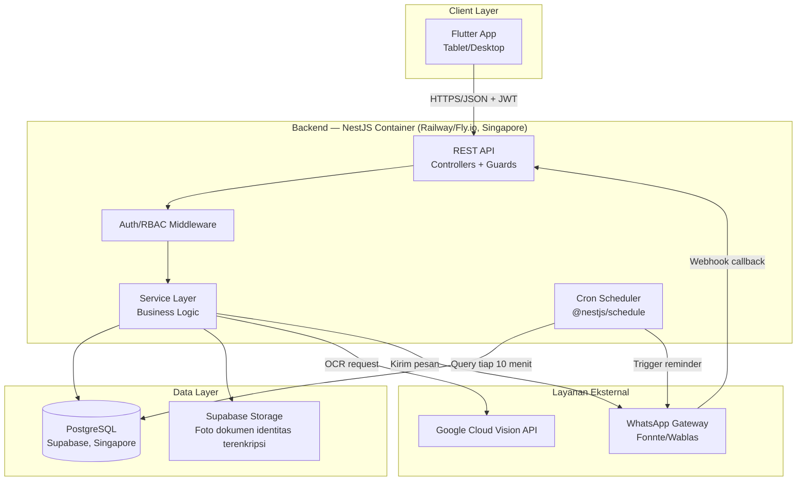

# 🧩 System Design Document
## Sinar Harapan Frontdesk & Property Management System (PMS)

---

## Dokumen Kontrol

| Item | Detail |
|---|---|
| Versi | 1.0 — Baseline |
| Tujuan | Pandangan menyeluruh sistem: goals, estimasi kapasitas, komponen, trade-off, dan rencana skalabilitas |
| Audiens | Tech lead, developer baru yang onboarding, AI agent yang perlu konteks "kenapa" di balik keputusan arsitektur |
| Terkait | `prd.md`, `arsitektur.md`, `backend.md`, `database.md`, `security.md`, `business-flow.md` |

---

## 1. Goals & Non-Goals

### 1.1 Goals (Tujuan Sistem)

- Mempercepat proses check-in tamu hotel dari 5-7 menit menjadi < 2 menit via OCR dokumen identitas (KTP/Paspor/SIM).
- Memberikan visibilitas status kamar real-time ke resepsionis (< 1,5 detik load time).
- Mengotomatisasi pengingat check-out via WhatsApp tanpa campur tangan manual (kecuali fallback).
- Memberi manajer visibilitas operasional & finansial instan tanpa rekap manual.
- Sistem harus tetap dapat dioperasikan (mode degradasi) walau layanan pihak ketiga (OCR/WA) down.

### 1.2 Non-Goals (Eksplisit Di Luar Scope MVP)

- **Bukan** sistem multi-tenant/multi-hotel pada MVP — didesain untuk satu properti (Hotel Sinar Harapan), meski skema database sudah cukup dekat untuk diperluas ke multi-tenant di masa depan (lihat §8).
- **Bukan** integrasi Channel Manager multi-OTA — hanya RedDoorz secara manual (input booking code), tanpa sinkronisasi API otomatis.
- **Bukan** sistem point-of-sale (POS) restoran/F&B — hanya biaya tambahan sederhana saat checkout.
- **Bukan** sistem housekeeping terstruktur (checklist per kamar) — status "Dirty→Available" murni transisi manual oleh resepsionis.
- **Bukan** aplikasi self-service untuk tamu — tamu tidak punya akun/login sama sekali, murni penerima notifikasi pasif.

---

## 2. Ringkasan Kebutuhan (Rujuk `prd.md` untuk Detail)

| Kategori | Ringkasan |
|---|---|
| Fungsional | 6 modul: Auth, Room Management, Reservation/OCR, WhatsApp Automation, Check-out/Invoice, Reporting |
| Non-Fungsional Kritis | Room grid < 1,5 detik; OCR < 3 detik; uptime 99,5%; enkripsi AES-256 untuk data dokumen identitas (KTP/Paspor/SIM) |
| Pengguna | 2 role, jumlah user kecil (estimasi 3-8 resepsionis per shift rotasi + 1-3 manajer) |
| Platform | Tablet landscape 10"+ (utama), desktop 1920x1080 (sekunder) |

---

## 3. Estimasi Kapasitas & Beban

> Estimasi kasar untuk SATU hotel skala kecil-menengah (asumsi realistis berdasarkan konteks PRD — hotel mitra RedDoorz, bukan hotel bintang 5 besar). Angka ini menentukan bahwa sistem TIDAK memerlukan arsitektur high-scale sejak awal.

| Metrik | Estimasi |
|---|---|
| Jumlah kamar | 20–60 kamar |
| Transaksi check-in/hari | 15–40 (asumsi okupansi 50-80%, sebagian multi-night) |
| Concurrent user aktif | 2–5 resepsionis (shift bergantian, jarang lebih dari 2 aktif bersamaan di satu waktu) + 1 manajer sesekali |
| Request room grid polling | ~1 request/15 detik per sesi aktif → puncak realistis < 20 request/menit |
| Volume database per tahun | Reservations: ~10.000–15.000 baris/tahun; Activity logs: beberapa kali lipat dari itu — tetap kategori "kecil" untuk PostgreSQL modern |
| Ukuran storage foto dokumen identitas | ~1,5MB/foto × ~15.000 check-in/tahun ≈ 22GB/tahun — perlu dipantau untuk kebijakan retensi (`security.md` §6.3) |

**Implikasi desain:** beban sistem ini **kecil** dibanding kapasitas standar PostgreSQL/Node.js modern. Ini mendukung keputusan arsitektur modular monolith (bukan microservices) dan hosting container tunggal (Railway/Fly.io) — kompleksitas microservices/orkestrasi tidak dibutuhkan dan justru menambah overhead operasional yang tidak proporsional dengan beban aktual.

---

## 4. Komponen Sistem & Interaksi



### 4.1 Kenapa Modular Monolith, Bukan Microservices

| Pertimbangan | Alasan |
|---|---|
| Skala beban | Lihat §3 — volume transaksi kecil, tidak ada bottleneck yang butuh scaling independen per komponen |
| Kompleksitas tim | Tim kecil (indikasi dari sprint plan 8 minggu) — overhead microservices (service discovery, distributed tracing, network latency antar service) tidak sebanding manfaatnya di skala ini |
| Konsistensi transaksi | Alur check-in butuh transaction ACID lintas tabel (`rooms`, `guests`, `reservations`) — jauh lebih sederhana dalam satu database/proses daripada distributed transaction lintas service |
| NestJS modularity | Struktur module NestJS (lihat `backend.md` §3) sudah memberi *pemisahan logis* yang cukup (rooms, reservations, notifications, reports sebagai module terpisah) TANPA overhead deployment terpisah — jika suatu saat memang perlu dipecah, batas module sudah jelas |

**Kapan mempertimbangkan microservices:** jika roadmap multi-hotel (§8) terealisasi dengan skala puluhan-ratusan properti dan beban jauh lebih besar, modul `notifications` (WA) atau `reports` (generasi laporan berat) adalah kandidat pertama untuk dipisah menjadi service/worker independen.

---

## 5. Alur Data Kritis

### 5.1 Check-in (Jalur Kritis Utama — Lihat Detail di `business-flow.md` §2)

```
Flutter → POST /ocr/extract-identity → Google Vision (≤3s) → Flutter (form terisi)
Flutter → POST /reservations → NestJS Service → Prisma Transaction (row lock) → PostgreSQL
                                                → Response ke Flutter → Room Grid ter-update
```

**Latensi target end-to-end:** OCR (≤3 detik) + input manual resepsionis (variabel) + submit (≤1 detik) = total tetap dalam target NFR < 2 menit keseluruhan proses (bukan hanya API call).

### 5.2 Cron Reminder (Proses Latar Belakang)

```
@Cron('*/10 * * * *') → Query PostgreSQL (partial index, lihat database.md §6)
                       → Untuk setiap hasil: WhatsApp Gateway API
                       → Update wa_reminder_sent_at
                       → (Async) Webhook callback dari provider → update wa_delivery_status
```

**Karakteristik:** proses ini idempotent secara desain — kolom `wa_reminder_sent_at` mencegah pengiriman ganda meski cron job ter-trigger dua kali karena alasan tertentu (restart proses, dsb.).

---

## 6. Reliabilitas & Mode Kegagalan (Failure Modes)

| Komponen Gagal | Dampak | Mode Degradasi |
|---|---|---|
| **Google Cloud Vision (OCR) down** | Auto-fill dokumen identitas (KTP/Paspor/SIM) tidak berfungsi | Fallback ke input manual penuh — proses check-in TETAP BISA berjalan (lihat `business-flow.md` §4). Sistem tidak punya single point of failure di jalur kritis check-in. |
| **WhatsApp Gateway down** | Pengingat otomatis tidak terkirim | Resepsionis tetap punya sinyal visual (badge Kuning H-1 jam di Room Grid) sebagai cadangan — tidak 100% bergantung pada WA (lihat `business-flow.md` §11.2). Resend manual tersedia saat layanan pulih. |
| **Database (Supabase Postgres) down** | Seluruh sistem tidak bisa baca/tulis data | **Ini adalah single point of failure sesungguhnya** — mitigasi: pilih plan Supabase dengan SLA uptime tinggi, backup otomatis (`database.md` §7), monitoring alert cepat. Offline-caching Flutter (§6.1 di bawah) membantu untuk sisi input, TAPI tidak menggantikan kebutuhan database untuk validasi real-time (mis. cek kamar available). |
| **Backend container crash/restart** | Downtime singkat seluruh API | Platform (Railway/Fly.io) auto-restart container; health check endpoint (`/health`) dipakai monitoring untuk deteksi cepat |
| **Koneksi internet lobi hotel terputus** | Resepsionis tidak bisa akses backend sama sekali | Offline-caching Flutter menyimpan input form sementara, auto-sync saat koneksi pulih (lihat `arsitektur.md` §2.3) — TIDAK bisa memvalidasi ketersediaan kamar real-time selama offline, risiko double-booking manual harus dimitigasi secara prosedural (komunikasi antar shift) |

### 6.1 Mengapa Tidak Ada "Offline-First" Penuh

Sistem ini sengaja **tidak** didesain offline-first penuh (mis. local-first database dengan sync konflik resolusi) karena:
1. Validasi ketersediaan kamar HARUS real-time (mencegah double booking) — ini butuh source of truth tunggal di server.
2. Kompleksitas conflict resolution offline-first jauh melebihi kebutuhan skala hotel ini (§3).
3. Cukup dengan caching sementara untuk input form (mengurangi risiko kehilangan ketikan), bukan operasi penuh tanpa server.

---

## 7. Observability & Monitoring

| Aspek | Implementasi |
|---|---|
| Health check | `GET /health` — dipantau uptime monitor eksternal (UptimeRobot/Better Uptime) setiap 1-5 menit |
| Logging terpusat | Platform hosting logs (Railway/Fly.io bawaan) atau agregator eksternal (Logtail/Axiom) untuk error tracking |
| Alert kritis | Cron job WA reminder gagal ≥3x berturut → alert ke tim dev (lihat `arsitektur.md` §6.3) |
| Audit sebagai observability sekunder | `activity_logs` (lihat `database.md` §2.5) berguna ganda: kepatuhan keamanan DAN sumber investigasi saat troubleshooting perilaku user-reported |
| Metrik performa | Response time p95 API, durasi OCR call, durasi WA Gateway call — direkomendasikan APM sederhana (mis. Sentry Performance) di roadmap pasca-MVP jika dibutuhkan |

---

## 8. Skalabilitas & Roadmap Arsitektur

### 8.1 Jalur Evolusi yang Direncanakan

```
Fase 1 (MVP, Sekarang)
  └─ 1 hotel, modular monolith NestJS, Railway/Fly.io single container

Fase 2 (Jika hotel menambah properti kedua)
  └─ Opsi A: Deploy instance terpisah per hotel (paling sederhana, isolasi penuh)
  └─ Opsi B: Tambah kolom hotel_id ke skema (rooms, reservations, users, dst.)
             untuk multi-tenant dalam satu database — butuh migrasi skema +
             row-level filtering di setiap query (lebih efisien resource,
             lebih kompleks implementasi)

Fase 3 (Skala SaaS multi-hotel, puluhan+ properti)
  └─ Pisahkan modul berat (notifications, reports) jadi worker/service terpisah
     dengan message queue (mis. BullMQ + Redis) alih-alih @nestjs/schedule
     in-process, agar generasi laporan/pengiriman WA tidak membebani proses API utama
  └─ Pertimbangkan read replica database untuk beban baca dashboard yang tinggi
```

### 8.2 Prinsip: Jangan Optimasi Prematur

Keputusan untuk TIDAK membangun multi-tenancy atau microservices sejak MVP adalah **keputusan sadar**, bukan kelalaian — kompleksitas tersebut hanya bernilai jika beban aktual (§3) membutuhkannya. Membangunnya lebih awal berarti waktu development MVP (8 minggu, lihat `prd.md` §7) habis untuk infrastruktur yang belum terbukti dibutuhkan, alih-alih fitur yang langsung dirasakan hotel.

---

## 9. Trade-off Arsitektural Utama (Ringkasan Keputusan)

| Keputusan | Alternatif yang Dipertimbangkan | Alasan Pemilihan |
|---|---|---|
| NestJS (bukan Next.js App Router) | Next.js sebagai API layer | Fit alami untuk REST API murni + cron native + Guards/DI bawaan — lihat diskusi arsitektur sebelumnya |
| Modular monolith (bukan microservices) | Microservices per domain | Beban sistem kecil (§3), kompleksitas tidak sebanding manfaat di skala ini |
| Railway/Fly.io (bukan Vercel serverless) | Vercel + cron eksternal (QStash/cron-job.org) | Proses long-running native mendukung `@nestjs/schedule` tanpa workaround, cocok untuk beban always-on kecil-menengah |
| Prisma ORM (bukan raw SQL/query builder lain) | Knex, TypeORM, raw `pg` | Type-safety end-to-end dengan TypeScript, migration tooling matang, cukup fleksibel untuk raw query saat dibutuhkan (`FOR UPDATE` lock) |
| Snapshot `room_rate` di setiap reservasi | Referensi live ke `rooms.base_price_per_night` | Integritas historis invoice — perubahan tarif kamar di masa depan tidak boleh mengubah data transaksi lampau |
| OCR sebagai enhancement, bukan gerbang wajib | OCR sebagai syarat mutlak check-in | NFR kecepatan check-in tidak boleh bergantung pada uptime layanan pihak ketiga — lihat §6 |
| Signed URL 15 menit untuk foto dokumen identitas (bukan URL publik permanen) | Public bucket dengan URL tetap | Data dokumen identitas (KTP/Paspor/SIM) adalah PII kritis (`security.md` §2) — signed URL meminimalkan jendela eksposur |
| Polling 15 detik untuk Room Grid (bukan WebSocket) | WebSocket/Supabase Realtime | Kesederhanaan implementasi MVP cukup untuk skala concurrent user kecil (§3); WebSocket adalah upgrade path yang jelas jika dibutuhkan latensi lebih rendah (lihat `arsitektur.md` §2.2) |

---

## 10. Kesimpulan Desain

Sistem ini didesain sebagai **modular monolith yang disiplin**, bukan arsitektur distribusi kompleks — pilihan yang sengaja dibuat berdasarkan estimasi beban aktual satu hotel skala kecil-menengah (§3), bukan asumsi skala hipotetis. Batas modul NestJS (rooms, reservations, notifications, reports) memberi jalur evolusi yang jelas ke arah yang lebih terdistribusi (§8) JIKA dan HANYA JIKA kebutuhan bisnis nyata (multi-hotel, volume tinggi) benar-benar muncul — bukan dibangun spekulatif sejak awal.

Prioritas desain, berurutan: **(1) integritas data transaksi** (race condition, snapshot tarif), **(2) keamanan data tamu** (enkripsi, signed URL, RBAC), **(3) keandalan operasional** (fallback manual saat layanan eksternal down), **(4) kecepatan** (NFR performa), **(5) skalabilitas masa depan** — urutan ini mencerminkan bahwa sistem ini melayani transaksi finansial & data pribadi sensitif di lingkungan operasional yang tidak boleh berhenti, sebelum menjadi sistem yang "scalable" secara teoritis.
